**🏴‍☠️ Pirate's Clash: East Blue Saga**

A 2D action game inspired by classic pirate anime adventures reimagined with my unique way.

**🎮 About the Game**

**Pirate’s Clash: East Blue Saga** is a fast-paced 2D action game where you fight as one of five original pirate characters each with their own unique powers and fighting style.  

Travel through 5 exciting levels across the Blue Sea. Fight your way through:

- 👮 Relentless navy soldiers  
- 💀 Deadly enemy pirates  
- 👹 Powerful bosses  

All brought to life with colorful 2D art, smooth controls, and dynamic gameplay.

🎯 Features

- 🏴 5 unique playable pirates  
- 🌊 5 action-packed levels  
- ⚔️ Real-time combat with special abilities  
- 💥 Epic boss fights  
- 🎨 Vibrant 2D visuals  
- 🕹️ Built in **Unity** using **C#**

🎁 Bonus Mini-Games

When you're not battling on the high seas, take a break with two extra pirate-themed challenges:

- 🧠 **Memory Match** – Test and train your memory  
- 🧩 **Puzzle Challenge** – A simple, fun logic puzzle  

**▶️ Play Now!**

🌐 Try the game in your browser or download it from Itch.io:  
👉 [**Play Pirate's Clash on Itch.io**](https://isha-skylz.itch.io/pirates-clash-east-blue-saga)

🛠️ How It Was Made

This game was built using:

- Unity 2D Engine  
- C# scripting 
- Inspired by anime-style storytelling and visuals

# 📷 Screenshots

  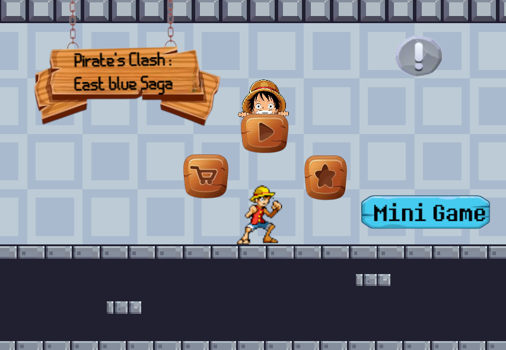
  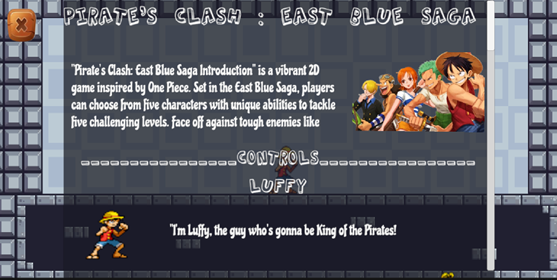
  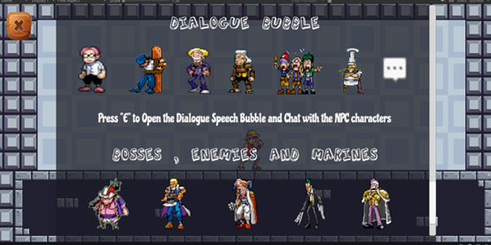
  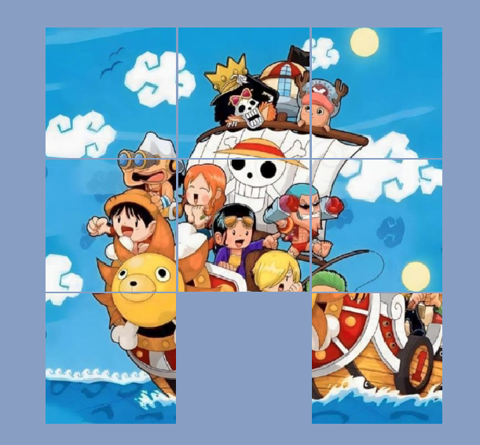
  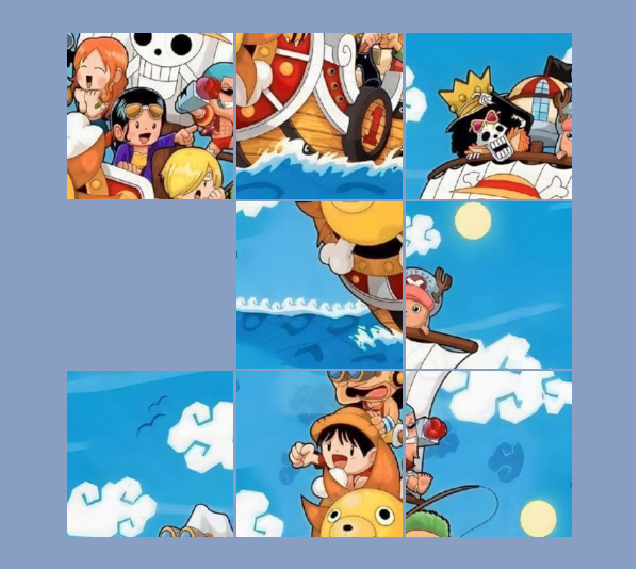
  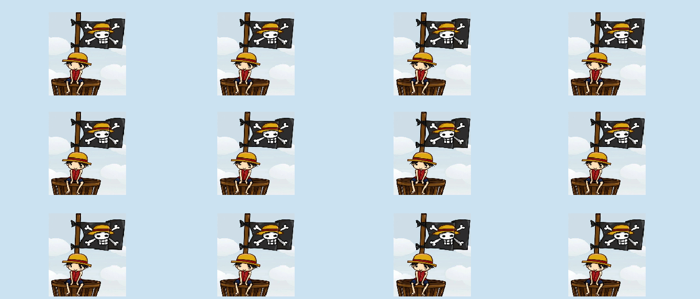
  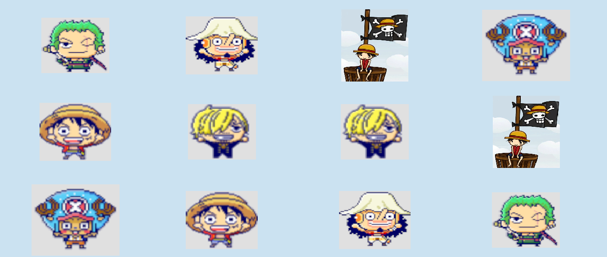
  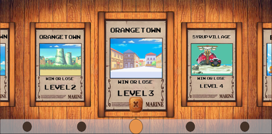
  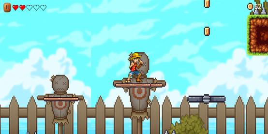
   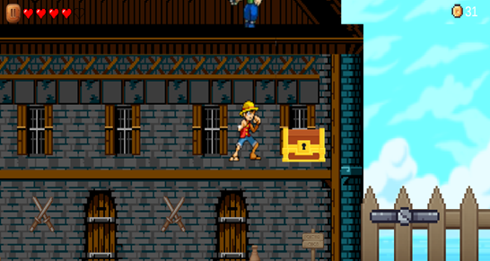
  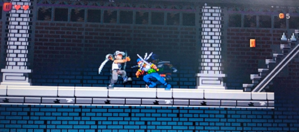
  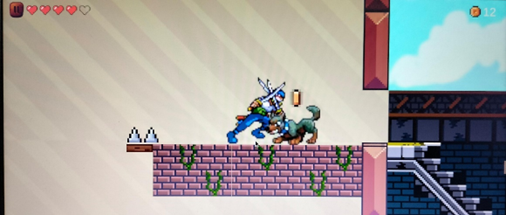
  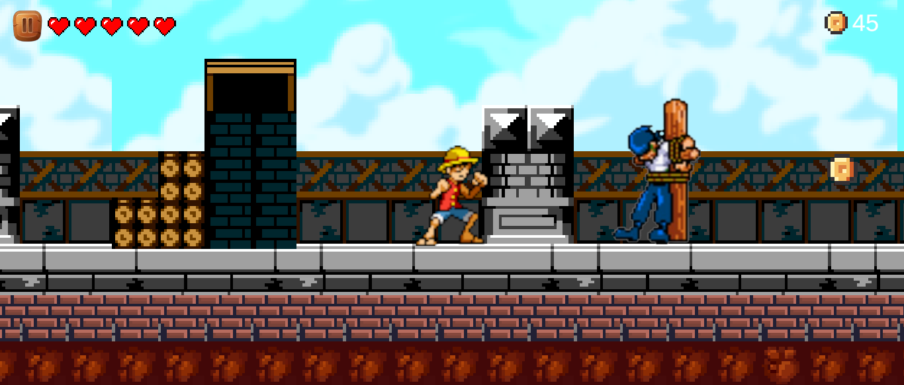
  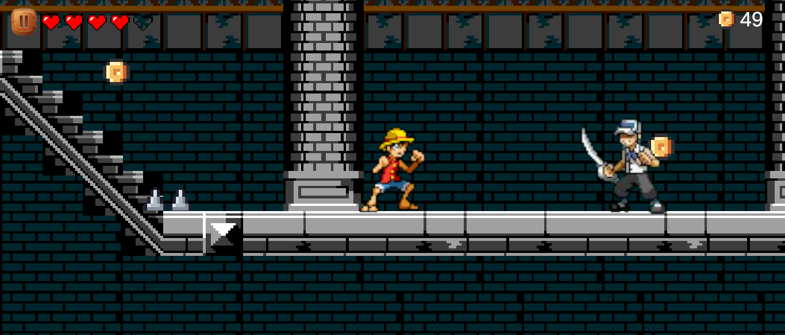
  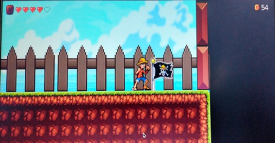

